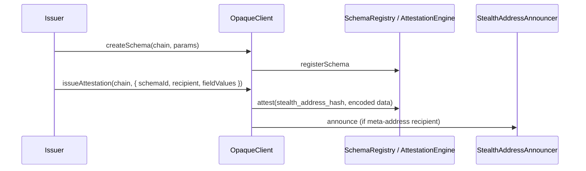
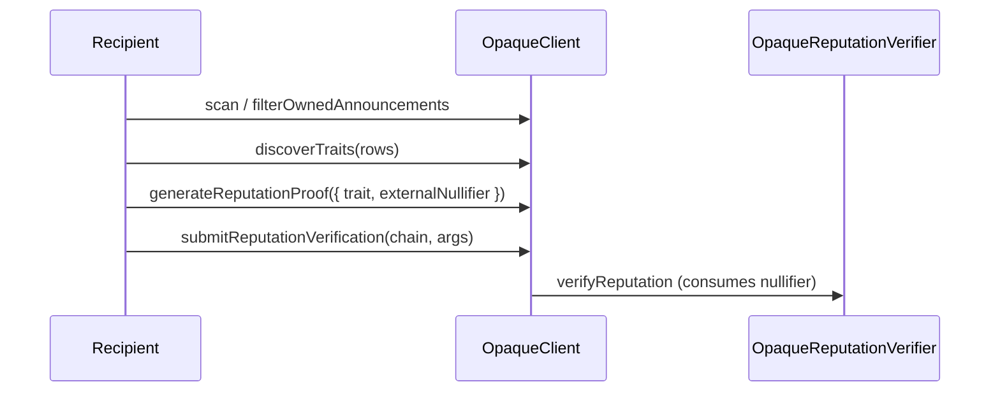

[PSR](https://github.com/opaquecash/spec/blob/main/PSR.md) (Provable Stealth Reputation) lets issuers attest facts about a **stealth identity** without learning the recipient's public address. Recipients discover traits via their scanner and prove them with zero-knowledge.

## V2 model

| On-chain object | Purpose |
| --- | --- |
| **Schema** | Defines attestation fields (`bool passed, u64 score`), revocability, optional resolver |
| **Attestation** | Binds field values to a `stealth_address_hash` (32-byte commitment) |
| **Announcement** | Optional discovery marker so the recipient's WASM scanner finds the trait |

Schemas and attestations return chain-neutral `SchemaV2` / `AttestationV2` shapes from both Ethereum and Solana.

## Issuer flow



## Recipient flow



## Recipient formats

`issueAttestation` accepts:

| Format | Example | Announce? |
| --- | --- | --- |
| 66-byte meta-address | `0x` + 132 hex chars | Yes (default) |
| 20-byte stealth address | EVM address | Resolves to hash |
| 32-byte hash | `stealth_address_hash` | No ephemeral key, announce skipped |

## Action scopes and nullifiers

Proofs are scoped to a specific action via `externalNullifier`:

```ts
import { buildActionScope, externalNullifierFromScope } from "@opaquecash/opaque";

const scope = buildActionScope(11155111, "my-dapp", "gate-v1");
const externalNullifier = externalNullifierFromScope(scope);
```

The same trait + scope can only be verified once (nullifier consumed on-chain).
