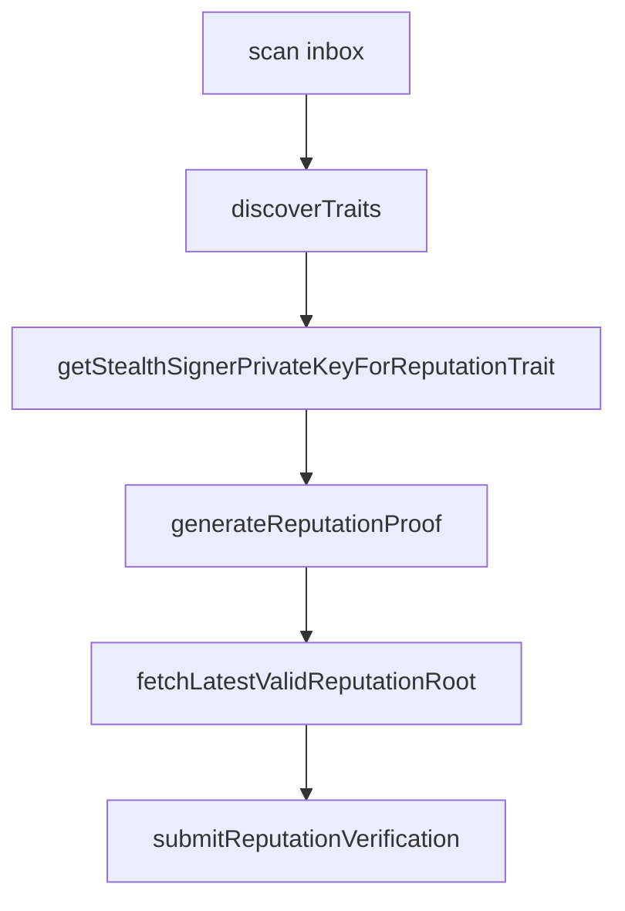

This guide covers trait discovery, Groth16 proof generation, simulation, and submission to `OpaqueReputationVerifier`.

## Prerequisites

- WASM module (`wasmModuleSpecifier`)
- Owned announcements with PSR attestation metadata
- `snarkjs` (pulled in by `@opaquecash/psr-prover`)
- Circuit artifacts (default: hosted on opaque.cash `/circuits/...`)

## Step 1: Discover traits

```ts
const inbox = await client.scan({ chains: ["ethereum"] });
const rows = inbox.map(/* convert to IndexerAnnouncement if needed */);
const traits = await client.discoverTraits(rows);

if (traits.length === 0) {
  throw new Error("No reputation traits found in inbox");
}

const trait = traits[0];
```

## Step 2: Reconstruct the stealth signing key

```ts
const stealthPrivKeyBytes = client.getStealthSignerPrivateKeyForReputationTrait(trait);
// Or from a scan output:
// client.getStealthSignerPrivateKey(output)
```

## Step 3: Build the action scope

```ts
import { buildActionScope, externalNullifierFromScope } from "@opaquecash/opaque";

const scope = buildActionScope({
  chainId: 11155111,
  module: "my-app",
  actionId: "premium-gate",
});
const externalNullifier = externalNullifierFromScope(scope).toString();
```

Or use the equivalent static helpers on the client
(`OpaqueClient.buildReputationActionScope` / `reputationExternalNullifierFromScope`).

## Step 4: Generate the proof

```ts
const proofData = await client.generateReputationProof({
  trait,
  stealthPrivKeyBytes,
  externalNullifier,
  onProgress: (stage, pct) => console.log(stage, pct),
  // artifacts: { wasmPath, zkeyPath }  // override default hosted paths
});

// proofData: { proof, publicSignals, nullifier, attestationId }
```

## Step 5: Fetch a valid Merkle root

```ts
const merkleRoot = await client.fetchLatestValidReputationRoot();
const valid = await client.isReputationRootValid(merkleRoot);

const history = await client.fetchReputationRootHistory();
```

## Step 6: Simulate (optional)

```ts
await client.simulateReputationVerification(walletClient, {
  proofData,
  merkleRoot,
  externalNullifier,
});
```

## Step 7: Verify view (read-only)

```ts
const ok = await client.verifyReputationProofView({
  proofData,
  merkleRoot,
  externalNullifier,
});
```

## Step 8: Submit on-chain

Consumes the nullifier on success:

```ts
const { txHash } = await client.submitReputationVerification("ethereum", {
  proofData,
  merkleRoot,
  externalNullifier,
});
```

Solana:

```ts
await client.submitReputationVerification("solana", {
  proofData,
  merkleRoot,
  externalNullifier,
});
```

## Full flow diagram



<Note>
  Each `(trait, externalNullifier)` pair can only be verified once. Choose scopes carefully per action you gate.
</Note>
