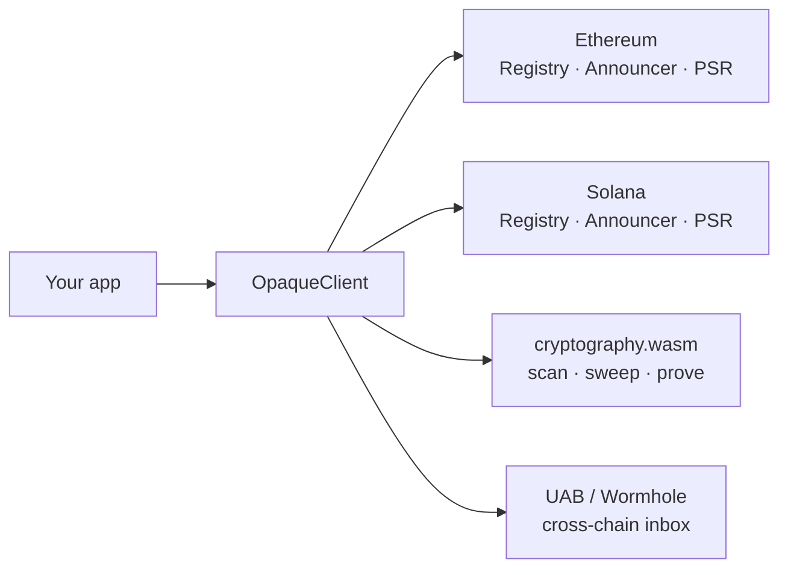

Opaque is a cross-chain privacy stack for unlinkable payments and zero-knowledge reputation. Configure one client (`@opaquecash/opaque`) and integrate stealth sends, PSR attestations, inbox scanning, and Groth16 proofs without touching chain-specific libraries directly.

<CardGroup cols={2}>
  <Card title="Quickstart" icon="rocket" href="/quickstart">
    Install the SDK, derive keys, and run your first flow in five minutes.
  </Card>
  <Card title="OpaqueClient reference" icon="code" href="/sdk/opaque-client">
    Full API for the unified client: stealth, PSR, reputation, and UAB.
  </Card>
  <Card title="Create a schema" icon="layer-group" href="/guides/create-schema">
    Register a PSR schema and issue attestations on Ethereum or Solana.
  </Card>
  <Card title="Scan and sweep" icon="inbox" href="/guides/scan-and-sweep">
    Discover owned stealth outputs across chains and move funds to a fresh address.
  </Card>
</CardGroup>

## What you can build

| Capability | Description |
| --- | --- |
| **Stealth payments (CSAP)** | EIP-5564 meta-addresses, one-time stealth destinations, on-chain announcements |
| **Reputation (PSR)** | Schema registry, stealth-bound attestations, Groth16 proofs without revealing identity |
| **Cross-chain (UAB)** | Relay announcements over Wormhole so payments on one chain appear in the other chain's inbox |

## Architecture at a glance

## Supported networks (testnet)

| Chain | ID / cluster | Status |
| --- | --- | --- |
| Ethereum Sepolia | `11155111` | Stealth, PSR V2, UAB, reputation verifier |
| Solana devnet | `devnet` | Stealth, PSR V2, reputation verifier |

Contract addresses ship inside the SDK (see [Deployments](/protocol/deployments)). Override any address via `OpaqueClient.create({ contracts: { ... } })`.

## Packages

Most apps only need **`@opaquecash/opaque`** (plus **`@opaquecash/react`** for React
apps). Contract addresses and program ids ship in the generated
**`@opaquecash/deployments`** registry. Lower-level packages (`stealth-chain`,
`psr-core`, `uab`, etc.) are re-exported when you need a narrow surface. See
[Installation](/sdk/installation).
